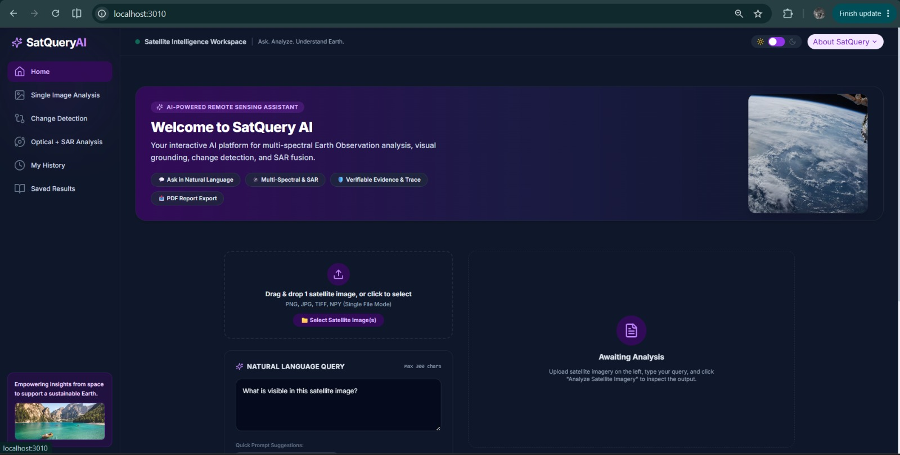
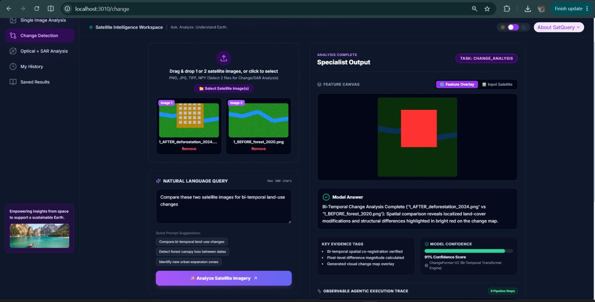
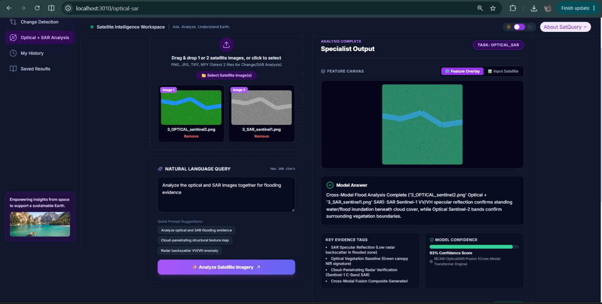
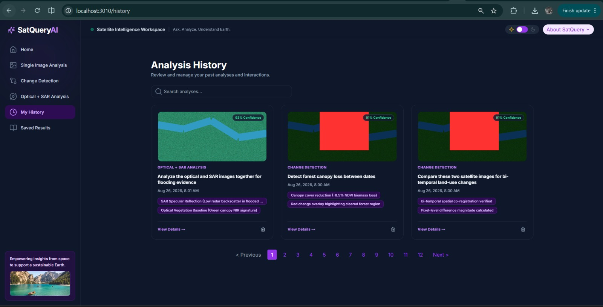

# 🛰️ SatQuery AI

### AI-Powered Remote Sensing Assistant

SatQuery AI is an interactive platform for analyzing satellite imagery using natural-language queries. It combines specialized remote-sensing analysis workflows with visual evidence, confidence scores, and an observable execution trace to make satellite image analysis more accessible and interpretable.

## ✨ Features

* 🔍 *Single Image Analysis* — Analyze satellite imagery using natural-language questions.
* 🔄 *Change Detection* — Compare satellite images from different time periods and identify changes.
* 🛰️ *Optical + SAR Analysis* — Analyze optical and SAR imagery together for complementary insights.
* 📍 *Visual Evidence* — View detected regions and generated feature overlays.
* 📊 *Confidence & Evidence* — Understand the evidence supporting each analysis.
* 🤖 *Agentic Task Routing* — Identify the analysis task and route it to the appropriate specialist module.
* 🕒 *Analysis History* — Review previous analyses and results.
* 📄 *PDF Report Export* — Export analysis results as downloadable reports.

## 🖥️ Screenshots

### Home



### Single Image Analysis


### Change Detection



### Optical + SAR Analysis



### Analysis History



## 🧠 Analysis Capabilities

### Single Image Analysis

Ask questions about a satellite image in natural language, generate scene descriptions, and identify visual features.

### Change Detection

Upload two images and analyze bi-temporal changes such as land-use modifications, vegetation loss, or newly developed regions.

### Optical + SAR Analysis

Analyze optical and SAR observations together to identify complementary information and improve interpretation of satellite imagery.

### Explainable Results

Each analysis provides:

* Model-generated answer
* Key evidence
* Confidence score
* Visual feature overlay
* Observable execution trace

## 🛠️ Tech Stack

| Category      | Technologies                                  |
| ------------- | --------------------------------------------- |
| Frontend      | Next.js, React, TypeScript, Tailwind CSS      |
| Backend       | Python, FastAPI                               |
| AI / ML       | Vision-Language Models, Remote Sensing Models |
| Visualization | Image & Feature Overlays                      |
| Reporting     | PDF Report Generation                         |

## ⚙️ How It Works

The user uploads satellite imagery and enters a natural-language query. SatQuery AI identifies the required analysis task and routes the request to the corresponding specialist module. The result is presented with supporting evidence, confidence information, and an observable execution trace.

Current specialist workflows include:

* Visual Question Answering (VQA)
* Scene Captioning
* Visual Grounding
* Bi-Temporal Change Analysis
* Optical + SAR Analysis

## 🚀 Getting Started

### Prerequisites

* Node.js 18+
* Python 3.10+
* pip

### Installation

```bash
git clone https://github.com/KrishPamnani8/SIH_2026.git
cd SIH_2026

npm install
pip install -r backend/requirements.txt
```

### Run the Application

Start the frontend:

```bash
npm run dev
```

Start the backend:

```bash
python backend/main.py
```

The frontend will be available at:

```text
http://localhost:3010
```

The backend API will be available at:

```text
http://localhost:8000
```

API documentation:

```text
http://localhost:8000/docs
```

## 📌 Project Status

*Early Prototype — Smart India Hackathon 2026*

The current repository demonstrates the core SatQuery AI workflow, including satellite image upload, natural-language interaction, task routing, specialized analysis, evidence visualization, confidence scoring, analysis history, and report generation.

## 👥 Team

Built for *Smart India Hackathon 2026*.

---

<p align="center">
  <b>🛰️ SatQuery AI</b><br>
  Ask. Analyze. Understand Earth.
</p>
